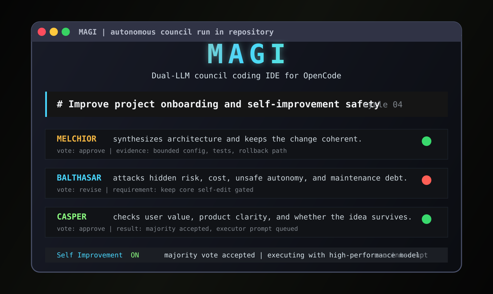
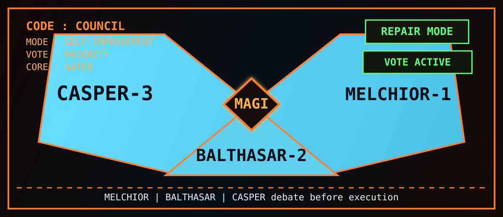

# Oh-My-Magi

**하나의 목표를 지속적으로 발전시키는 Magi 의회와 실제 OmO 실행 시스템.**

<p align="center">
  
</p>

[English](README.md) · [설치·설정](packages/oh-my-magi/README.md) · [구현 감사](docs/RELEASE-AUDIT.md)

Oh-My-Magi(OMM)는 OpenCode에서 [oh-my-openagent](https://github.com/code-yeongyu/oh-my-openagent)(OmO) 위에 동작하는 연구·개발 상위 시스템입니다. 공식 `oh-my-opencode@4.19.4`를 의존성으로 설치하고 실제 서버 플러그인을 초기화합니다. OmO의 에이전트·도구·전문가 위임·백그라운드 작업 관리 기능을 그대로 사용합니다.

Magi는 하나의 목표를 저장하고, 다음 작업을 제안하며, 세 의회의 판단을 받아 승인된 작업을 OmO에 맡깁니다. 작업 후에는 검증 명령과 독립 리뷰를 거쳐 다음 단계로 이어집니다. **반복 횟수 제한은 없습니다.** 초기 계획을 마치면 같은 목표 안에서 다음 연구·개선 단계를 계속 제안합니다.

<p align="center">
  
</p>

_Magi 오리지널 컨셉 이미지. 세 개의 지성이 토론하고, 실행 에이전트들이 행동하며, 하나의 목표를 계속 발전시킵니다. OMM은 이 정체성을 OmO 기반 플러그인으로 이어갑니다._

## 설치

OpenCode 프로젝트에서 npm 패키지를 설치합니다.

```sh
opencode plugin oh-my-magi
```

OMM 하나만 등록하면 고정 버전의 OmO를 함께 불러옵니다. 기존에 OmO가 설치돼 있으면 인식 가능한 등록을 백업하고 OMM으로 전환하며, 모델·에이전트 설정은 보존합니다. 시작 중 전환 안내가 나오면 **OpenCode를 한 번 재시작**하면 됩니다. 이미 로드된 OmO와 이중으로 실행되는 것을 방지하기 위한 과정입니다.

현재 소스는 Bun 1.3.13 이상과 OpenCode 1.18.29 이상을 지원 대상으로 하며, 최신 SDK·호환성 대상은 1.18.30입니다.

```sh
git clone --branch omm https://github.com/eljja/Magi.git
cd Magi
bun install --ignore-scripts
cd packages/oh-my-magi
bun run build
bun bin/cli.ts install --local --project /프로젝트/절대경로
```

빌드 후 대상 프로젝트에서 `opencode plugin /Magi/packages/oh-my-magi/절대경로`로 등록할 수도 있습니다. 기존 설치에서 전환한다면 위 OMM 설치 도구가 인식 가능한 구형 등록을 백업·정리합니다.

OpenCode 모델과 검증 명령을 설정하고 재시작한 뒤 사용합니다.

```text
/magi start 이 연구 파이프라인의 재현성과 정확도를 지속적으로 개선해줘
/magi status
새로운 실험보다 기존 결과의 재현성을 우선해줘.
왜 이 방식을 선택했어? 설명만 해줘.
/magi stop
/magi resume
```

OpenCode에 연결된 로컬 LLM도 사용할 수 있습니다. 모델 인증은 OpenCode가 관리하며, OmO의 에이전트별 모델 제약은 유지합니다. Magi 에이전트를 선택하기만 해서는 자동 실행을 시작하지 않습니다.

## 보고와 사용자 개입

프로젝트의 **`.magi/index.html`**을 브라우저에서 열면 목표, 실행 상태, 의회 표결, 최근 결정, 도구 활동, 대기 중인 사용자 지시를 볼 수 있습니다. 페이지는 15초마다 갱신됩니다. 목표를 실행 중인 OpenCode 세션에서 Sisyphus에게 말하듯 평소처럼 대화하면 됩니다. 별도 스티어링 명령은 필요하지 않습니다.

| 파일                            | 내용                                                                |
| ------------------------------- | ------------------------------------------------------------------- |
| `.magi/COUNCIL.md`              | 제안·토론·승인·거절·수정 요구·실행 결과·사용자 개입을 누적한 회의록 |
| `.magi/STATUS.md`               | 최신 진행 보고                                                      |
| `.magi/reports/YYYY-MM-DD.md`   | 실행 중 1분마다 누적하는 진행 보고                                  |
| `.magi/events/YYYY-MM-DD.jsonl` | 진행 중인 표결과 오류까지 남기는 이벤트 기록                        |
| `.magi/ROADMAP.md`              | 마일스톤과 검증된 진행 상황                                         |
| `.magi/runtime/`                | 목표·소유 세션·사용자 지시·재개 상태                                |

Melchior는 구조와 과학적 타당성, Balthasar는 위험과 안전, Casper는 실용성과 사용자 의도를 평가합니다. 의회의 실제 LLM 판단과 자동 수집한 도구 활동은 구분해서 표시합니다. 하위 에이전트의 도구 활동도 수집하며, 도구가 반환됐다는 사실만으로 성공했다고 기록하지 않습니다.

실행 중인 목표 세션의 일반 대화는 회의록에 기록되고 다음 회의에 전달됩니다. 질문에는 대화로 답하며, 질문을 작업 변경 승인으로 간주하거나 그 답변을 마일스톤 완료 증거로 사용하지 않습니다. 지시는 승인된 다음 작업에 반영될 때까지 보존합니다. 다른 세션의 대화나 중지 상태의 대화는 목표에 개입하거나 자동 실행을 재개하지 않습니다. `/magi steer`는 기존 사용자를 위한 선택 사항으로 남아 있습니다. 회의 중에도 보고는 별도 타이머로 갱신하며, 중지 후 같은 목표로 재개할 수 있습니다.

회의 라운드에도 횟수 제한을 두지 않습니다. 승인되지 않은 회의는 반론을 저장하고 다음 라운드에서 초안을 수정·재심의합니다. `USER-GUIDANCE.md`에는 대화 원문을, `MEMORY.md`에는 요약 기억을 유지하며, 이후 회의와 컨텍스트 압축 때 기존 회의록과 함께 다시 읽습니다. 정체된 실행은 감시기가 복구하며, 일시적 장애에는 대기 간격을 늘려 재시도합니다.

Windows에서 OpenCode 자체가 기존 런타임 폴더의 읽기 전용 속성 때문에 `EEXIST`로 시작하지 못하면 `bunx oh-my-magi doctor --repair-windows --project <프로젝트>`로 점검한 뒤 재시작하세요. 파일이나 접근 권한 목록은 변경하지 않습니다. 자세한 운영·버전 갱신 절차는 [패키지 문서](packages/oh-my-magi/README.md)를 참고하세요.

## OmO와 Magi의 역할

**OmO가 실행하고 Magi가 목표·회의·검증·다음 작업을 관리합니다.** 초기 작업도 실제 OmO 실행 에이전트에 전달합니다. 에이전트 이름만 설정에 있는지 확인하는 대신 런타임에서 실행 에이전트를 검증하며, 없으면 기본 에이전트로 조용히 대체하지 않습니다.

두 시스템이 서로 다음 작업을 시작하는 충돌을 막기 위해 `.omo/omo.jsonc`에서 OmO의 `todo-continuation-enforcer`, `goal`, `atlas` 스케줄링 훅을 비활성화합니다. 기존 설정은 보존·백업합니다. Atlas를 포함한 OmO 에이전트와 도구는 유지하며, 독립 반복 제어는 Magi가 담당합니다.

무인 실행에는 OpenCode 서버가 계속 살아 있어야 합니다. 서버를 재시작하고 프로젝트를 불러오면 저장된 목표로 복구합니다. 플러그인 자체가 운영체제 서비스를 설치하거나 꺼진 컴퓨터에서 실행되지는 않습니다.

## 검증 범위

Windows의 실제 OpenCode 1.18.30과 공식 OmO 4.19.4에서 기존 OmO 설정 전환·재시작, 플러그인 설치, 주요 에이전트 등록, 최초 Sisyphus 실행, `task → explore → read` 위임, 반복 실행, 사용자 지시, 중지·재개, 보고 생성을 결정적인 로컬 테스트 제공자로 검증했습니다.

CLI·데스크톱·웹은 같은 서버 기능을 사용합니다. 터미널 패널은 TUI 전용이며, 모니터 페이지는 별도로 여는 로컬 문서입니다. **npm 공개, 실제 모델 장기 실행, 다른 운영체제 CI 결과, 데스크톱·TUI 전체 조작 및 재접속 검증은 별도 공개 전 확인 항목입니다.** 이를 완료했다고 주장하지 않습니다.

OMM 자체 코드는 MIT이며, **OmO 의존성은 SUL-1.0**입니다. [라이선스 고지](packages/oh-my-magi/THIRD-PARTY-NOTICES.md)를 확인하세요. 이 저장소는 OmO 공식 제품이 아닙니다.

**npm 게시 대기:** 검증한 0.1.0 패키지의 실제 게시가 npm 2FA 정책(E403)으로 거부됐습니다. 인증을 완료해 게시하기 전까지 공개 이름 설치는 사용할 수 없으며, 위 로컬 소스 설치 경로를 사용할 수 있습니다. [게시 기록](docs/RELEASE-AUDIT.md#publication-attempt)을 확인하세요.

