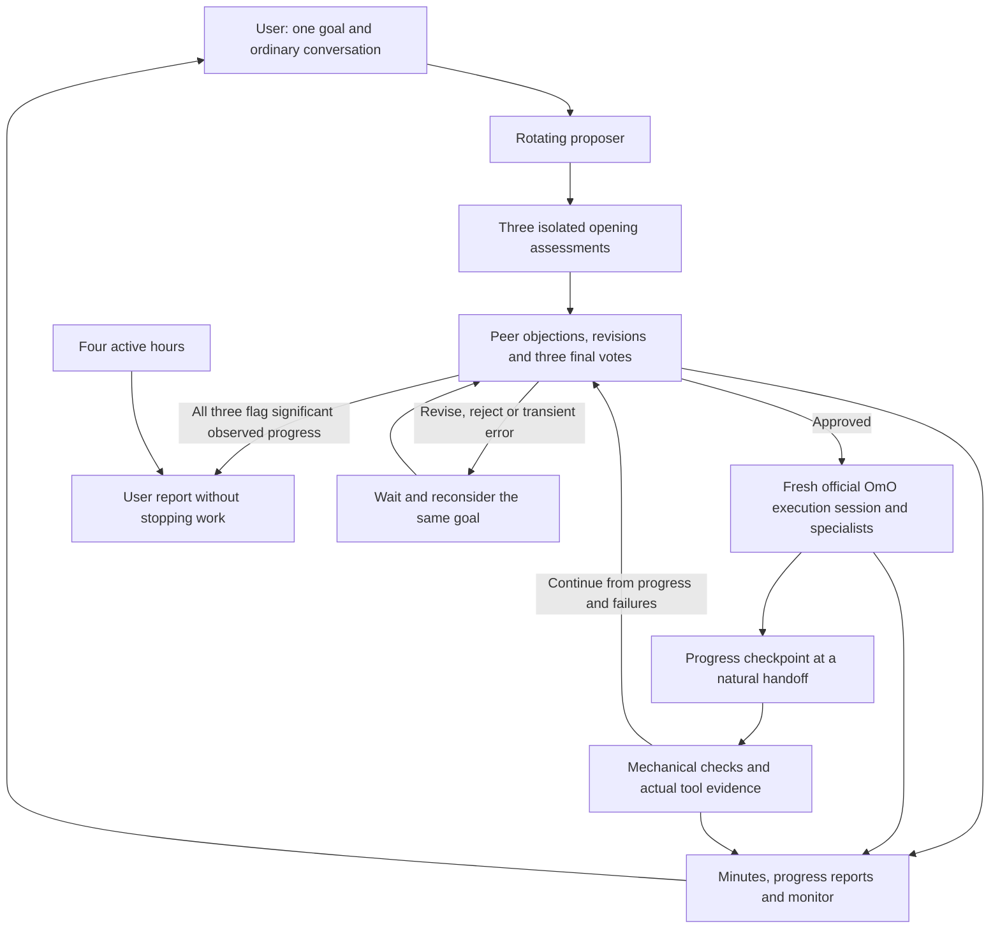

# Oh-My-Magi

**Unattended continuity qualification has not passed.** A real free model repaired code, passed protected original tests and entered the next meeting, but repeated decision tool calls recurred. Windows desktop usage also remains unverified. See the [installation, CLI and GUI evaluation](docs/END-TO-END-AUDIT.ko.md); public npm 0.1.1 and subsequent source fixes are tracked separately.

**One persistent goal. The real OmO workforce. A council you can observe and guide.**

<p align="center">
  
</p>

[한국어](README.ko.md) · [Installation and configuration](packages/oh-my-magi/README.md) · [Engineering audit](docs/RELEASE-AUDIT.md) · [Contributing](CONTRIBUTING.md)

**Continuous operation:** the default loop no longer requires a separate completion vote. Progress and checks feed the next planning meeting. User reports arrive after about four active hours or when all three identities flag significant observed progress, without stopping work. See the [current operation guide (Korean)](docs/CONTINUOUS-OPERATION.ko.md). Earlier free-model tests repaired code and passed preserved original tests; they do not qualify long-running operation of this revised loop. The [historical live-model audit](docs/REAL-MODEL-AUDIT.ko.md) remains available.

Oh-My-Magi (OMM) adds continuous research and development governance to [oh-my-openagent](https://github.com/code-yeongyu/oh-my-openagent) (OmO) on OpenCode. It loads the official `oh-my-opencode@4.19.4` server plugin as a dependency, including its agent factories, tools, skills, MCP integration and background task manager. These are upstream implementations, not recreated agent prompts.

Magi maintains one goal, proposes the next step, obtains independent council votes, delegates approved work to the OmO workforce, and verifies the result. **There is no iteration limit.** Completing the initial roadmap leads to another research or improvement increment within the same goal.

The three council perspectives are **Melchior** (architecture and scientific reasoning), **Balthasar** (risk and safety veto), and **Casper** (practical value and user intent). Their model-generated decisions are recorded separately from automatic tool telemetry.

Each identity has an isolated decision session and a persistent judgment history. They assess the proposal independently, then read one another's arguments and cast validated final votes. All three votes are required before applying the voting policy. Approved work runs in a fresh official OmO child session, keeping the human conversation available for guidance. An unavailable council member or reviewer resumes from saved evidence instead of discarding completed work. These are separate agent identities; they can share one model or use different models.

**Progress feeds the next decision.** At a natural workforce handoff, actual execution evidence and mechanical checks feed the next planning meeting. `magi_submit` is optional. Continuous mode has no separate completion vote; passing tests do not declare the lifelong goal complete. Explicit legacy `selfImprovement.mode: "complete"` retains milestone completion review.

New goals use the requested outcome as the default milestone. The council chooses the investigation, implementation and experiment increments; a baseline report cannot complete a development request. Existing roadmaps are preserved. Repeated identical tool results trigger recovery after the configured stall interval, without limiting goal or meeting iterations.

<p align="center">
  
</p>

_Original Magi concept artwork: three minds deliberate, the workforce acts, and one goal keeps advancing. OMM carries this identity into its OmO-based plugin._

## Install

**0.1.1 is published on npm.** The registry's `latest` tag points to this release, and the downloaded package matches the verified release artifact. Update from 0.1.0 to receive these fixes.

Run this in your operating-system terminal, then restart OpenCode:

```sh
opencode plugin oh-my-magi@0.1.1 --global
```

The npm package is **oh-my-magi**; `omm` names an unrelated package. Use `--global` for availability across folders. Only OMM needs registration; it loads its pinned OmO dependency. Existing recognized OmO registrations are backed up and migrated while preserving model and agent settings. If migration occurs at startup, restart OpenCode once to load the new configuration without duplicate managers.

To use the current source with Bun **1.3.13+** and OpenCode **1.18.29+** (current target: **1.18.31**):

```sh
git clone --branch omm https://github.com/eljja/Magi.git
cd Magi
bun install --ignore-scripts
cd packages/oh-my-magi
bun run build
bun bin/cli.ts install --local --project /absolute/path/to/your/project
```

Alternatively, run `opencode plugin /absolute/path/to/Magi/packages/oh-my-magi` in the target project after building. OpenCode detects the server and optional TUI targets. The OMM installer additionally backs up and migrates recognized legacy registrations.

Without Git, download and extract the [omm source ZIP](https://github.com/eljja/Magi/archive/refs/heads/omm.zip), then start at `bun install --ignore-scripts` in the extracted folder. Git is optional for source installation as well as execution.

Connect a model in OpenCode, select **magi**, and send your goal. The runtime starts automatically; Git is optional and missing verification checks can be established by the first approved task:

```text
Continuously improve the reproducibility and accuracy of this research pipeline
/magi status
Prioritize reproducibility before adding new experiments.
Why did you choose this approach? Just explain it.
/magi stop
/magi resume
```

Local OpenCode-compatible LLM providers are supported; Magi uses OpenCode's existing authentication and provider settings. OmO's agent-specific model restrictions still apply. See the [configuration guide](packages/oh-my-magi/README.md#models-and-verification).

## Observe and intervene

Reports are delivered to the original OpenCode conversation without extra model calls, and saved in `.magi/LATEST-REPORT.md` and `.magi/reports/msg_*.md`. Paused/offline time is excluded from the four-hour clock. Failed delivery retries while development continues. Use `oh-my-magi monitor --project <folder>` or **Open Magi Live Monitor** in the TUI palette to open the local page. It shows independent arguments and final reasons as they arrive, with up to 15–30 seconds of browser display latency; the TUI reads every two seconds.

Open **`.magi/index.html`** in a browser for the goal monitor. It refreshes every 15 seconds and shows the current goal, phase, council votes, recent decisions, tool activity and pending guidance. Talk normally in the OpenCode session running your goal to guide Magi, just as you would talk to Sisyphus. No steering command is required.

| Artifact                        | Purpose                                                                                                                     |
| ------------------------------- | --------------------------------------------------------------------------------------------------------------------------- |
| `.magi/COUNCIL.md`              | Accumulating meeting minutes: proposals, votes, rejected/revised decisions, approved directives, outcomes and user guidance |
| `.magi/members/*.md`            | Each identity's own accumulated final judgments, available in later meetings                                                |
| `.magi/STATUS.md`               | Latest readable progress report                                                                                             |
| `.magi/reports/YYYY-MM-DD.md`   | Progress snapshots every minute while active                                                                                |
| `.magi/events/YYYY-MM-DD.jsonl` | Durable council/controller events, including intermediate votes and failures                                                |
| `.magi/ROADMAP.md`              | Current milestones and verified progress                                                                                    |
| `.magi/runtime/`                | Saved goal, session ownership, pending guidance and recovery state                                                          |

Reporting continues while the council or executor is working. Tool telemetry includes descendant sessions; it does not pretend that a tool completion is an LLM judgment or a verified success. Ordinary messages in the active goal session are recorded in the meeting ledger and queued for the next council deliberation. Questions receive conversational answers; they are not new work authorization, and their replies cannot count as milestone completion. Guidance stays queued until an approved council step incorporates it. Messages in other sessions or while stopped do not steer or restart the goal. `/magi steer` remains an optional compatibility command.

Meetings have no round limit: unapproved proposals return with recorded objections for revision and further evidence. `USER-GUIDANCE.md` retains conversation history and `MEMORY.md` holds working memory; later meetings and context compaction read them alongside the council ledger. A watchdog detects stalled workforce attempts, and transient failures use increasing retry delays without imposing a goal iteration limit.

The monitor shows requests and errors for each council identity independently of workforce tool counts. Repeating identical tool results does not reset the evidence-progress timeout. Recovery carries the collected results forward. Workers cannot issue user steering or stop the goal through Magi's control tools.

## How it works



Magi owns the project's autonomous scheduling. Startup prepares `.omo/omo.jsonc` and disables OmO's competing `todo-continuation-enforcer`, `goal` and `atlas` scheduling hooks. **The upstream agents and tools remain available**, including Atlas as an agent; its independent continuation loop is replaced by Magi's council loop. Other configured OmO capabilities and permission controls remain in effect.

Keep an OpenCode server running for unattended work. The saved goal recovers when the server restarts and loads the project. OMM is a plugin, not an operating-system service: it cannot work while its host, machine or LLM is unavailable. It waits or retries rather than claiming unverified completion.

## Compatibility and release status

**0.1.1 is available:** agent selection and ordinary goal entry start automatically; Git is optional and council members exchange arguments before final votes. Continuous mode carries progress into the next meeting without a completion vote; scheduled and significant-progress reports do not stop the loop.

**Published:** [oh-my-magi 0.1.1](https://www.npmjs.com/package/oh-my-magi/v/0.1.1) is the npm `latest` release. Its downloaded artifact matches the reviewed release tarball. See the [publication record (Korean)](docs/RELEASE-AUDIT.md#publication-011).

- **Compatibility:** minimum OpenCode `1.18.29`, current SDK/target `1.18.31`, official OmO npm stable `4.19.4`. CI checks the minimum and moving latest versions. See the [upgrade procedure](packages/oh-my-magi/README.md#updating-compatibility).
- **Actual Windows integration (OpenCode 1.18.29 and 1.18.31):** global installation into a non-repository folder with Git absent from PATH, existing OmO migration/restart, selecting Magi and sending an ordinary goal, real `task → explore → read`, three consecutive cycles, conversational steering, stop/resume and reports passed with a deterministic local provider.
- **Cross-platform CI:** all six minimum/latest OpenCode jobs on Linux, macOS and Windows, plus the core regression job, passed. [Published implementation validation run](https://github.com/eljja/Magi/actions/runs/35451257603).
- **Package validation:** regression coverage includes partial-vote recovery, isolated execution, reviewer outages, control ownership and repeated-evidence stalls. See the [dated audit](docs/AUTONOMY-DESIGN.ko.md) for commands and scope.
- **CLI, desktop and web:** share the server-side agents, tools and commands. The optional TUI panel is specific to the terminal; the file-based monitor works separately in a browser.
- **Actual-provider testing:** `bun run smoke:live` uses a selected zero-price OpenRouter model, real OpenCode and official OmO in an isolated folder. It checks protected original behavior tests and preserves public evidence. See the [reproduction guide](docs/AUTONOMY-DESIGN.ko.md#검증과-재현).
- **Remaining qualification checks:** reliable complete real-provider workflows, endurance runs, full interactive desktop/TUI and reconnect QA. Short automated tests do not prove infinite uptime or every upstream feature/provider combination.

See the [0.1.1 user-flow audit (Korean)](docs/USER-FLOW-AUDIT.ko.md) and [historical 0.1.0 release audit](docs/RELEASE-AUDIT.md). The repository retains an older OpenCode fork and legacy Magi packages; the maintained plugin is `packages/oh-my-magi`.

## License

OMM's own code is MIT. **The OmO dependency is SUL-1.0, not MIT**, and retains its original notices and restrictions. See [third-party notices](packages/oh-my-magi/THIRD-PARTY-NOTICES.md) and [security](SECURITY.md). OMM is not an official upstream OmO product.
