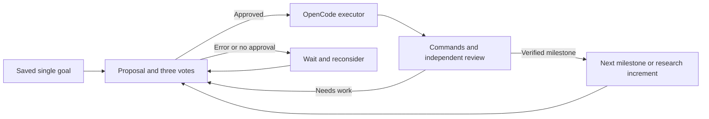

# Magi / oh-my-magi

**One persistent goal. Continuous research and development inside OpenCode.**

[한국어](README.ko.md) · [Plugin guide](packages/oh-my-magi/README.md) · [Compatibility and audit](docs/RELEASE-AUDIT.md) · [Contributing](CONTRIBUTING.md)

oh-my-magi is a server plugin with an optional terminal panel. MELCHIOR proposes a step, the three council roles review it, and Sisyphus executes approved work through OpenCode. Mechanical checks and a separate reviewer evaluate the result before the roadmap advances.

The default mode has **no cycle limit**. After the initial milestones, Magi keeps proposing research increments for the same goal. Transient failures and withheld council approval cause a delayed reconsideration. `/magi stop` stops continuation.

## Install

The npm package was **not yet published** when checked on 2026-09-08. The intended public command, after publication, is:

```sh
opencode plugin oh-my-magi
```

For the current source release, install [Bun](https://bun.sh) and OpenCode **1.18.29**, then:

```sh
git clone https://github.com/eljja/Magi.git
cd Magi
bun install --ignore-scripts
cd packages/oh-my-magi
bun run build
bun bin/cli.ts install --local --project /absolute/path/to/your/project
```

Restart OpenCode in that project, configure an OpenCode model/provider, and enter:

```text
/magi start Improve the reproducibility and accuracy of my research pipeline
/magi status
/magi stop
/magi resume
```

A selected `magi` agent can also call `magi_start`, `magi_status`, and `magi_stop`. Selecting an agent alone does not start a loop. Model credentials stay in OpenCode; no Magi-specific API key is required. A local model exposed through an OpenCode provider can be used.

Keep the OpenCode server running for unattended work. See the [headless setup and verification configuration](packages/oh-my-magi/README.md). Missing verification is never accepted as proof of completion.

## How it continues



State, the owning session, the roadmap, and review history are stored under `.magi/`. A server restart can recover that goal when the project is loaded again. Magi does not install an operating-system service or keep working while the machine/server is off.

## Compatibility and provenance

- **OpenCode 1.18.29:** actual Windows installation and server smoke test passed with a deterministic local provider; the server advanced into a third cycle after two verified executor turns and accepted stop.
- **CLI/TUI:** shared server engine; optional terminal panel uses the current keymap API. Full interactive terminal rendering still needs manual release QA.
- **Desktop and web:** the backend agents, tools, and commands use the shared OpenCode server. The terminal panel is not a desktop/web widget. Browser project/session navigation, Magi selection, and /magi status were verified. Full desktop and reconnect QA remain release checks.
- **oh-my-openagent:** this package is an independent, OmO-inspired implementation. It does **not** bundle the upstream OmO execution engine. At audit time, npm `latest` was `oh-my-opencode@4.19.4` and `beta` was `5.0.0-beta.48`. See [provenance and coexistence](docs/RELEASE-AUDIT.md#upstream-and-omo).

This monorepo also retains the older OpenCode fork and `packages/magi-opencode-plugin`. They are legacy paths, with separate behavior and compatibility. Do not enable the legacy plugin alongside oh-my-magi. The [migration guide](packages/oh-my-magi/README.md#migrating-from-the-legacy-magi-plugin) explains cleanup.

## Before public release

The [release audit](docs/RELEASE-AUDIT.md) records fixed defects, reproducible checks, and remaining release gates. Publication, real-provider endurance tests, and interactive desktop/web/TUI QA are not represented as completed.

Magi executes model-selected work with the permissions of the OpenCode process. Run it in an appropriate environment, configure reproducible checks, and review work before publishing. See [Security](SECURITY.md).

Magi's own code is MIT-licensed. OpenCode and other dependencies retain their own licenses. No claim of upstream OmO affiliation or feature parity is made.
