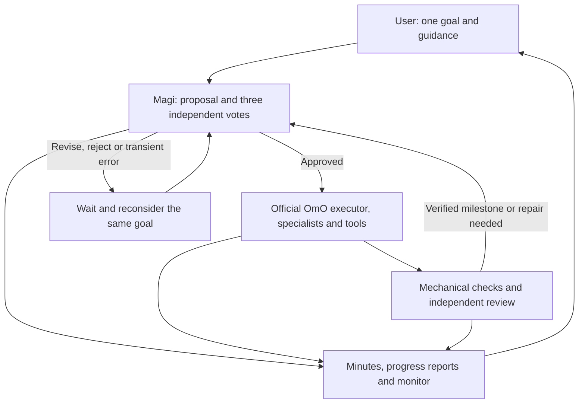

# Oh-My-Magi

**One persistent goal. The real OmO workforce. A council you can observe and guide.**

<p align="center">
  
</p>

[한국어](README.ko.md) · [Installation and configuration](packages/oh-my-magi/README.md) · [Engineering audit](docs/RELEASE-AUDIT.md) · [Contributing](CONTRIBUTING.md)

Oh-My-Magi (OMM) adds continuous research and development governance to [oh-my-openagent](https://github.com/code-yeongyu/oh-my-openagent) (OmO) on OpenCode. It loads the official `oh-my-opencode@4.19.4` server plugin as a dependency, including its agent factories, tools, skills, MCP integration and background task manager. These are upstream implementations, not recreated agent prompts.

Magi maintains one goal, proposes the next step, obtains independent council votes, delegates approved work to the OmO workforce, and verifies the result. **There is no iteration limit.** Completing the initial roadmap leads to another research or improvement increment within the same goal.

The three council perspectives are **Melchior** (architecture and scientific reasoning), **Balthasar** (risk and safety veto), and **Casper** (practical value and user intent). Their model-generated decisions are recorded separately from automatic tool telemetry.

<p align="center">
  
</p>

_Original Magi concept artwork: three minds deliberate, the workforce acts, and one goal keeps advancing. OMM carries this identity into its OmO-based plugin._

## Install

Install the npm package in your OpenCode project:

```sh
opencode plugin oh-my-magi
```

Only OMM needs registration; it loads its pinned OmO dependency. Existing recognized OmO registrations are backed up and migrated while preserving model and agent settings. If migration occurs at startup, restart OpenCode once to load the new configuration without duplicate managers.

To use the current source with Bun **1.3.13+** and OpenCode **1.18.29+** (current target: **1.18.30**):

```sh
git clone --branch omm https://github.com/eljja/Magi.git
cd Magi
bun install --ignore-scripts
cd packages/oh-my-magi
bun run build
bun bin/cli.ts install --local --project /absolute/path/to/your/project
```

Alternatively, run `opencode plugin /absolute/path/to/Magi/packages/oh-my-magi` in the target project after building. OpenCode detects the server and optional TUI targets. The OMM installer additionally backs up and migrates recognized legacy registrations.

Configure a model/provider in OpenCode, define reproducible verification commands, then restart OpenCode in the project:

```text
/magi start Continuously improve the reproducibility and accuracy of this research pipeline
/magi status
Prioritize reproducibility before adding new experiments.
Why did you choose this approach? Just explain it.
/magi stop
/magi resume
```

Local OpenCode-compatible LLM providers are supported; Magi uses OpenCode's existing authentication and provider settings. OmO's agent-specific model restrictions still apply. See the [configuration guide](packages/oh-my-magi/README.md#models-and-verification).

## Observe and intervene

Open **`.magi/index.html`** in a browser for the goal monitor. It refreshes every 15 seconds and shows the current goal, phase, council votes, recent decisions, tool activity and pending guidance. Talk normally in the OpenCode session running your goal to guide Magi, just as you would talk to Sisyphus. No steering command is required.

| Artifact                        | Purpose                                                                                                                     |
| ------------------------------- | --------------------------------------------------------------------------------------------------------------------------- |
| `.magi/COUNCIL.md`              | Accumulating meeting minutes: proposals, votes, rejected/revised decisions, approved directives, outcomes and user guidance |
| `.magi/STATUS.md`               | Latest readable progress report                                                                                             |
| `.magi/reports/YYYY-MM-DD.md`   | Progress snapshots every minute while active                                                                                |
| `.magi/events/YYYY-MM-DD.jsonl` | Durable council/controller events, including intermediate votes and failures                                                |
| `.magi/ROADMAP.md`              | Current milestones and verified progress                                                                                    |
| `.magi/runtime/`                | Saved goal, session ownership, pending guidance and recovery state                                                          |

Reporting continues while the council or executor is working. Tool telemetry includes descendant sessions; it does not pretend that a tool completion is an LLM judgment or a verified success. Ordinary messages in the active goal session are recorded in the meeting ledger and queued for the next council deliberation. Questions receive conversational answers; they are not new work authorization, and their replies cannot count as milestone completion. Guidance stays queued until an approved council step incorporates it. Messages in other sessions or while stopped do not steer or restart the goal. `/magi steer` remains an optional compatibility command.

Meetings have no round limit: unapproved proposals return with recorded objections for revision and further evidence. `USER-GUIDANCE.md` retains conversation history and `MEMORY.md` holds working memory; later meetings and context compaction read them alongside the council ledger. A watchdog detects stalled workforce attempts, and transient failures use increasing retry delays without imposing a goal iteration limit.

## How it works



Magi owns the project's autonomous scheduling. Startup prepares `.omo/omo.jsonc` and disables OmO's competing `todo-continuation-enforcer`, `goal` and `atlas` scheduling hooks. **The upstream agents and tools remain available**, including Atlas as an agent; its independent continuation loop is replaced by Magi's council loop. Other configured OmO capabilities and permission controls remain in effect.

Keep an OpenCode server running for unattended work. The saved goal recovers when the server restarts and loads the project. OMM is a plugin, not an operating-system service: it cannot work while its host, machine or LLM is unavailable. It waits or retries rather than claiming unverified completion.

## Compatibility and release status

**Publication pending:** the reviewed 0.1.0 artifact passed integration tests, but npm rejected publishing with E403 because the credential lacks the required 2FA authorization. The public-name command below becomes available after successful npm publication. Use the documented local-source installation until then. See the [publication record](docs/RELEASE-AUDIT.md#publication-attempt).

- **Compatibility:** minimum OpenCode `1.18.29`, current SDK/target `1.18.30`, official OmO npm stable `4.19.4`. CI checks the minimum and moving latest versions. See the [upgrade procedure](packages/oh-my-magi/README.md#updating-compatibility).
- **Actual Windows integration (OpenCode 1.18.30):** existing OmO migration and restart, native plugin installation, real upstream agent registration, first execution through Sisyphus, `task → explore → read`, repeated goal cycles, steering, stop/resume and report generation were exercised with a deterministic local provider.
- **Package validation:** 81 automated tests (327 assertions) and typechecking passed; the built tarball also passed the integration smoke after installation into a separate consumer project.
- **CLI, desktop and web:** share the server-side agents, tools and commands. The optional TUI panel is specific to the terminal; the file-based monitor works separately in a browser.
- **Remaining qualification checks:** real-provider endurance runs, cross-platform CI results, full interactive desktop/TUI and reconnect QA. Short automated tests do not prove infinite uptime or every upstream feature/provider combination.

See the [audit and reproduction commands](docs/RELEASE-AUDIT.md). The repository retains an older OpenCode fork and legacy Magi packages; the maintained plugin is `packages/oh-my-magi`.

## License

OMM's own code is MIT. **The OmO dependency is SUL-1.0, not MIT**, and retains its original notices and restrictions. See [third-party notices](packages/oh-my-magi/THIRD-PARTY-NOTICES.md) and [security](SECURITY.md). OMM is not an official upstream OmO product.

