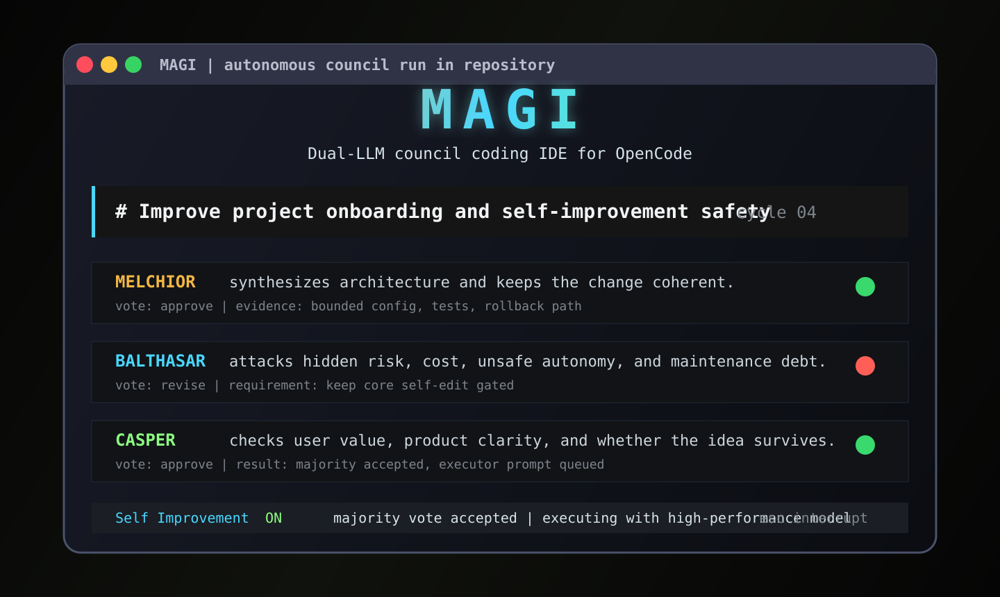
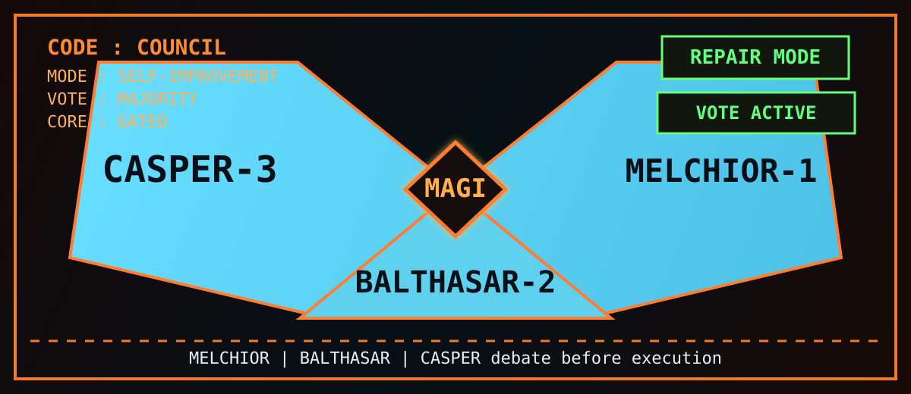

# oh-my-magi

<p align="center">
  
</p>

**Give one goal to Magi. Three independent council members deliberate. The real OmO agents execute.**

An OpenCode plugin built on the unmodified `oh-my-opencode@4.19.4` runtime. **oh-my-magi 0.2.0** integrates the latest continuous runtime from [packages/oh-my-openmagi](packages/oh-my-openmagi). The old implementation is retained as a private legacy workspace.

- One additional primary-agent choice: **Magi**. Melchior, Balthasar and Casper are real, hidden subagents.
- Independent opening opinions followed by three final votes. Two approvals pass only after all three valid votes arrive; concrete security/data-loss objections require revision.
- Approved tasks go to existing Sisyphus, Hephaestus, Prometheus or Atlas sessions with native OmO tools and specialists.
- Durable continuous intent, bounded retry waits, process supervision and explicit human stop/resume.
- Current votes, cumulative history and reports in ordinary Markdown files, with no additional UI.
- Reports every **one hour** by default, independently of ongoing work. Change the interval with commands or Korean conversation.

[한국어](README.ko.md) · [Installation and configuration](packages/oh-my-openmagi/README.md) · [0.2.0 release evidence (Korean)](docs/OH-MY-MAGI-0.2.0.ko.md)

<p align="center">
  
</p>

## Install or upgrade

For a new installation:

```sh
opencode plugin oh-my-magi@0.2.0 --global
```

For existing OmO/Magi registrations, stop the previous goal and host, then migrate:

```sh
bun install --global oh-my-magi@0.2.0
oh-my-magi install --global --project /absolute/project
```

Repeat without `--global` if the project also has registrations. The installer backs up old entries and preserves model settings. OmO installs as a dependency; do not register a duplicate OmO server plugin. Restart OpenCode, select **Magi** and enter your goal. Configure an LLM provider in OpenCode; Git is optional.

The 0.1.x goal state is not automatically resumed by the new runtime. Legacy documents are backed up; enter the goal again. Existing OpenMagi state paths and `.magi/openmagi.jsonc` stay compatible. The npm package name is **oh-my-magi**; `omm` is an included CLI alias.

## Use this checkout

Requires Bun ≥1.3.13 and OpenCode ≥1.18.29, <2.

```sh
bun install --ignore-scripts
cd packages/oh-my-openmagi
bun run build
bun dist/cli.js install --project /absolute/project --plugin /absolute/Magi/packages/oh-my-openmagi
```

Restart OpenCode, select **Magi** and describe your goal. The installer backs up recognized older registrations and preserves model configuration. Add `--global` when migrating the global OpenCode configuration.

The unified release is **oh-my-magi 0.2.0**. See the [release record](docs/OH-MY-MAGI-0.2.0.ko.md) for publication status and evidence for this exact version.

Use `/magi stop`, `/magi resume`, `/magi status`, `/magi report interval 1h`, `/magi report now` and `/magi report status`. Read `.magi/VOTES-LATEST.md`, `.magi/VOTES.md`, `.magi/COUNCIL.md` and `.magi/LATEST-REPORT.md` in the existing file viewer.

For a host independent of an attached GUI/TUI, run `bun dist/cli.js serve --project /absolute/project`; attach with the matching `attach` command. `service files` generates OS startup templates. See the [complete operating guide](packages/oh-my-openmagi/README.md).

Integration tests use actual OpenCode and OmO with an isolated deterministic model provider. Endurance results from another project do not qualify this artifact. GUI viewer refresh depends on the host. See the [release record](docs/OH-MY-MAGI-0.2.0.ko.md).

Own source: MIT. OmO dependency: SUL-1.0. [Third-party notices](packages/oh-my-openmagi/THIRD-PARTY-NOTICES.md). [Legacy documentation](README.legacy.md) and [legacy package](packages/oh-my-magi) are preserved.
