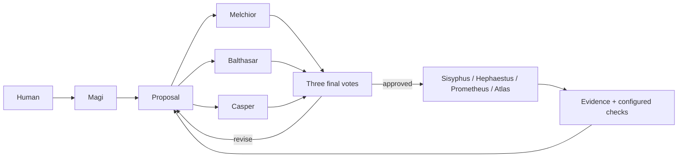

# oh-my-magi

One human conversation. Three independent council members. Continuous execution by the real OmO workforce.

Version **0.2.1** unifies the latest OpenMagi implementation under the public **oh-my-magi** package name. Requires **Bun ≥1.3.13** and **OpenCode ≥1.18.29, <2**. The integration pins **oh-my-opencode 4.19.4**.

## Upgrade from 0.1.x or the OpenMagi development name

Stop the previous goal/host before switching versions. The 0.2 runtime uses a new durable state format; it preserves legacy meeting/report files in backups but does not silently resume a 0.1.x goal. After installing, restart OpenCode, select **Magi**, and enter your goal again. Model credentials still need to be configured in OpenCode.

Use the installer below for both global and project registrations if both were configured. It backs up previous registrations and replaces duplicate OmO/Magi entries. OmO is a direct dependency and is loaded by Magi; do not install a second server plugin alongside it. **omm** and **oh-my-openmagi** are CLI aliases shipped by **oh-my-magi**, not npm installation names.

The source directory remains **packages/oh-my-openmagi** for continuity. The old source in **packages/oh-my-magi** is a private legacy workspace and cannot be published accidentally. Existing OpenMagi state locations, **OPENMAGI_HOME** and **.magi/openmagi.jsonc** are retained so a package-name change does not strand saved state.

## Start from this checkout

```sh
bun install --ignore-scripts
cd packages/oh-my-openmagi
bun run build
bun dist/cli.js install --project /absolute/project --plugin /absolute/Magi/packages/oh-my-openmagi
```

Restart OpenCode, select **Magi**, and describe the goal. To replace an active goal, stop it before starting the new goal. You can also use `/magi start <goal>`. Git is optional.

The installer backs up recognized old OmO/Magi registrations, preserves model settings and other plugins, and registers this package once. Use `--global` for the global OpenCode configuration. If the other scope also contains a separate OmO/Magi registration, migrate that scope too. Keep your existing `.omo/omo.jsonc` model configuration. Do not register a second OmO server plugin alongside OpenMagi.

In OmO 4.19.4, `.omo/omo.jsonc` keeps `agents` and `categories` at the root; OpenCode-specific options such as `telemetry`, `disabled_hooks`, `model_fallback` and `runtime_fallback` belong inside the `"[opencode]"` object. Unsupported root options can cause the entire configuration layer, including model overrides, to be ignored. Check that the intended agent models are registered after restarting OpenCode.

For an existing OmO/Magi installation, migrate with:

```sh
bun install --global oh-my-magi@0.2.1
oh-my-magi install --global --project /absolute/project
```

For a new installation without old registrations, OpenCode's native `opencode plugin oh-my-magi@0.2.1 --global` also works.

## How it runs



Only **Magi** is added to the primary-agent selector. `magi-melchior`, `magi-balthasar` and `magi-casper` are hidden subagents with separate sessions. Each supplies an independent opening opinion, then reads the other openings before submitting its final vote. All three valid final votes are required; two approvals pass. A concrete security or data-loss objection requires mitigation and a new round.

The selected existing OmO primary agent gets a fresh session and retains its real tools, specialists and background-task manager. Magi does not recreate those agents. Work proposals must select an available primary agent. If an approved executor disappears before dispatch, the council reconsiders using the current workforce. Upstream hooks are isolated from the Magi control and voting sessions; normal OmO sessions keep their upstream behavior.

A completed response, failed check, rejected vote, timeout, cancellation or process shutdown does **not** stop the goal. Work completion feeds the next planning cycle. When useful authorized work is exhausted, the council schedules a review instead of manufacturing activity.

Only direct human input stops/resumes or changes report timing. These controls are not exposed as model tools. Controls received from child sessions are rejected. Runtime-path guards prevent common accidental modifications; they are not an operating-system security sandbox. Keep appropriate native OpenCode permissions.

## Controls and reports

| Command                     | Effect                                            |
| --------------------------- | ------------------------------------------------- |
| `/magi start <goal>`        | Start a new goal while stopped                    |
| `/magi stop`                | Persist a stop and abort owned work               |
| `/magi resume`              | Resume the saved goal                             |
| `/magi status`              | Read actual saved status                          |
| `/magi report interval 30m` | Change the current goal's interval immediately    |
| `/magi report interval 1h`  | Hourly reports; the default                       |
| `/magi report interval 4h`  | Four-hourly reports                               |
| `/magi report now`          | Report now without shifting the periodic deadline |
| `/magi report status`       | Show the interval and next due time               |

Korean controls include “앞으로 한 시간마다 보고해”, “보고 간격을 30분으로 줄여”, “이제 네 시간마다 보고해도 돼”, “지금 진행 상황 알려줘”, “멈춰” and “재개해”. For unambiguous control, use the slash command. Quoted instructions and embedded stop words are not interpreted as stop commands.

Regular reports default to **one hour of elapsed time while the goal is running**, including API/dependency waits. They use saved observations, require no LLM call, and continue while work runs. Reports contain the current task/owner, execution evidence and checks, council decision, problems, retry time and next report time. They do not invent percentages. Missed reports are consolidated on reconnection. A stopped goal does not generate regular reports; manual status remains available. Superseded goals retain their archived reports without replaying them into a new goal. A report-file write failure does not block conversation delivery; projection is retried independently.

Equivalent shell commands use `oh-my-magi stop`, `resume`, `status`, `report interval 1h`, `report now`, `report status`, and `votes`, with `--project <path>`. A CLI control changes durable state even if the host is offline; actual work resumes when a host is available.

## Votes in the existing UI

No additional GUI, TUI widget or web dashboard is installed. Open the generated Markdown files in the existing file viewer or inspect them in a terminal.

- `.magi/VOTES-LATEST.md`: topic and each member's one-line opinion, with 🟢 찬성 / 🔴 반대 / 🟡 보완 요청 / 대기.
- `.magi/VOTES.md`: the latest 200 meeting blocks and links to the complete dated history.
- `.magi/COUNCIL.md`: opening opinions, final votes, evidence and recent execution records.
- `.magi/history/`: immutable dated meeting exports, with older days linked from the main history.
- `.magi/LATEST-REPORT.md` and `.magi/reports/`: latest report and report archive.

Initial opinions are never displayed as final votes. A meeting ID prevents duplicate history on restart. Documents are projections of the database and can be regenerated. Viewer auto-refresh depends on the host application; reopen/refresh the file if necessary. A timestamped file is not a promise that a disconnected host is live.

## Keep running independently of the GUI

```sh
oh-my-magi serve --project /absolute/project --port 4096
oh-my-magi attach --project /absolute/project
```

From this checkout, substitute `bun /absolute/Magi/packages/oh-my-openmagi/dist/cli.js` for `oh-my-magi`.

The supervisor starts a loopback-only, authenticated OpenCode server, checks the server and controller heartbeat, and restarts its own failed process tree with backoff. It never terminates an unrelated server using the port. The terminal running `serve` must remain open unless an OS service owns it. Closing an attached GUI/TUI does not stop this server.

On Windows, supervised hosts use a private OmO LSP daemon directory for each native process, overriding `OMO_LSP_DAEMON_DIR` within that child. This prevents shared LSP processes from retaining a crashed host's server port. Cleanup checks the private named pipe's actual Windows owner and process creation time before terminating that daemon and its remaining children. Other projects' daemons are left running. Direct OpenCode launches without `serve` do not get this supervisor cleanup.

`attach` uses the local connection credential automatically. For a GUI's existing server connection settings, use the URL/credential in the private `connection.json` alongside the database; `doctor` reports that directory. Do not commit or share this file.

Generate startup templates with:

```sh
oh-my-magi service files --project /absolute/project
```

This creates a systemd user unit, launchd plist and Windows scheduled-task XML in the private runtime directory. It does **not** install a global service. Register the appropriate file using your OS:

- Linux: copy `openmagi.service` into `~/.config/systemd/user/`, then `systemctl --user daemon-reload` and `systemctl --user enable --now openmagi`. Running before login also requires user lingering.
- macOS: copy the generated plist into `~/Library/LaunchAgents/`, then load it with `launchctl bootstrap gui/$(id -u) <absolute-plist-path>`.
- Windows: `schtasks /Create /TN OpenMagi /XML <absolute-xml-path> /F`, then `schtasks /Run /TN OpenMagi`. This template starts at user logon.

Use a distinct service/task name per project. A service must have Bun, network access, provider credentials and the same user/configuration environment. Service registration and OS reboot behavior must be validated on the deployment machine. No software can perform work while the machine is powered off. Saved intent survives; the supervisor/OS service resumes after the machine and dependencies return.

## Configuration

Create `.magi/openmagi.jsonc` yourself. It is read on subsequent runtime ticks. Unknown configuration keys, invalid provider/model names and overflowing request timers are rejected. Commands persist the current goal's report interval; the configured interval is the default for a new goal.

```jsonc
{
  "council": {
    // Optional: otherwise use the model selected for the goal.
    "model": "your-provider/your-model",
    "members": {
      // "balthasar": "your-provider/another-approved-model"
    },
    "fallbackModels": [],
  },
  "executors": {
    // Optional explicit overrides; otherwise use your configured OmO agent model.
    // "sisyphus": "your-provider/your-model"
  },
  "reporting": { "intervalMs": 3600000 },
  "resilience": {
    "requestTimeoutMs": 180000,
    "stallTimeoutMs": 1800000,
    "retryBaseMs": 15000,
    "retryMaxMs": 1800000,
  },
  "verification": [
    {
      "name": "package tests",
      "command": ["bun", "test"],
      "cwd": "packages/your-package",
      "timeoutMs": 120000,
    },
  ],
}
```

Verification commands are explicit argument arrays, run inside the project, and must be safe to rerun after interruption. Without them, reports explicitly say independent mechanical verification is not configured. The runtime does not call an agent's assertion a passing test.

Temporary process launch denials (`EPERM`, `EACCES`, `EBUSY`) retry after 1, 2 and 4 seconds, before any child has started. An unavailable executable remains a reported dependency wait and resumes verification when access recovers. It never counts as a passing check or replays the agent's completed work. A human stop cancels further launch attempts; nonzero command exits are not launch retries. Persistent OS access restrictions still require repair of the executable or its permissions.

The retry cap is a **maximum waiting interval**, not a retry-count limit. Retry-After is honored. Only explicitly configured council fallbacks are eligible; none are enabled by default. Provider configuration or missing credentials can require human repair. Magi continues to preserve intent and report the dependency wait.

SQLite WAL state lives outside the project under the per-user OpenMagi data directory, keyed by the canonical project path. `OPENMAGI_HOME` overrides that root. Stop the host before backing up/moving the whole directory, including SQLite WAL/SHM files. Moving a project changes its identity; do not delete the old state assuming it moved automatically.

Dispatch records and stable message IDs are saved before submission. An ambiguous response is checked against the existing session before retrying. Interrupted execution is preserved as evidence for inspection and a new council decision; arbitrary shell/API side effects cannot have a universal exactly-once guarantee.

Local modifications and tests follow the original goal. External publication/deployment/payment requires explicit standing user authority and existing native permissions. Keep provider/agent fallback choices in your approved OmO configuration too; this wrapper does not rewrite it.

## Development and release

Run checks from this package, not the repository root:

```sh
bun typecheck
bun test
bun run pack:check
bun script/audit.ts
bun run smoke
# Or all local checks plus both native compatibility versions:
bun run verify
```

Tests are restricted to `test/`, so exported audit copies cannot inflate the count. `pack:check` preserves each tarball, clean consumer installation, resolved dependency lock and hashes under `artifacts/runs/`; `artifacts/release.json` points to the latest release. Smoke and audit validate that installed artifact against these hashes.

Smoke tests use isolated OpenCode homes, the actual OmO package and a deterministic local model. They compare the original OmO agent definitions with the wrapped definitions and exercise background `task→explore→read`, synchronous `task(category=quick)→Sisyphus-Junior→read`, council sessions, malformed-vote recovery and timed reporting. They launch the installed CLI supervisor, kill only its owned native child, observe automatic recovery without manually relaunching it, and verify durable `/magi stop`. Required agents and their exact model overrides are checked before and after each restart. The smoke report interval is **12 seconds**, not a one-hour wall-clock test. `OPENMAGI_OPENCODE_VERSION` selects the compatibility version; `OPENMAGI_OPENCODE_BIN` optionally uses a preinstalled native executable whose hash and running version are checked.

For zero-cost real-provider qualification from this checkout:

```sh
# Existing OPENROUTER_API_KEY or --auth-file with an OpenCode openrouter API entry.
# Never paste credentials into prompts, reports or command arguments.
bun run soak --minutes 15 --max-requests 30
bun run soak --minutes 360 --max-requests 600 --crash-host --late-challenge
# Optional endurance evidence check, separate from this release:
bun run release:check
```

`--model` accepts a currently verified OpenRouter free tool model. The local gateway searches the live catalog for each permitted model, requires an exact ID match and current zero pricing, enforces zero provider price ceilings, disables routing fallbacks, rejects paid plugins/modalities and limits requests. A partial, missing or merely similar search result cannot authorize a call. The child receives only a temporary local gateway token. Quota failures wait; they never trigger a paid fallback or credit purchase. A duration/request boundary is an explicit test-induced stop, separate from Magi ending work by itself.

The real-provider harness records wall-clock progress, hourly reports, retries, provider usage and supervisor recovery in a disposable parser project with an independent checker. It verifies the required OmO agents and free model overrides at startup, on native process changes and before final judgment. Missing agents or incorrect models fail the run. The optional endurance profile requires six real hours, at least five hourly reports, verified progress spanning three hours, native-host crash recovery and repair of an injected regression. `release:check` checks that separate endurance profile for an exact artifact. It was not run or passed for this 0.2.1 naming-integration release. Results from another project or an earlier artifact are not this version's validation evidence. The release uses its own type, regression, packed-install and native integration checks.

Keep `runtime-*` directories private: they contain temporary connection credentials and session data. Share only the redacted top-level JSON/JSONL/log evidence, never whole runtime directories or authentication files. Test fixtures prove specific behavior; they do not establish absence of defects.

CI is configured for the minimum and current npm latest OpenCode versions on Windows, Linux and macOS; a local Windows run does not establish Linux/macOS results. The release workflow tests its packed artifact and uses npm trusted publishing when explicitly dispatched. After npm accepts the upload, `bun script/registry-check.ts` waits for the exact public version and latest tag, downloads the archive anonymously, and compares its integrity and SHA-256 with the qualified artifact. A pending registry response is not publication success. A newly packed artifact needs its own qualification evidence. GUI viewer refresh and OS-service startup require deployment-specific checks.

The dependency audit allows only the documented upstream Low Babel advisory. That is an **unpatched exception**, not a fix or proof of runtime unreachability. The command fails on other registry-reported advisories; it cannot guarantee that unknown vulnerabilities are absent.

Own source: MIT. Unmodified OmO dependency: **SUL-1.0**, with its own use/distribution conditions. See [third-party notices](THIRD-PARTY-NOTICES.md). This is not an entirely MIT-licensed dependency stack.
